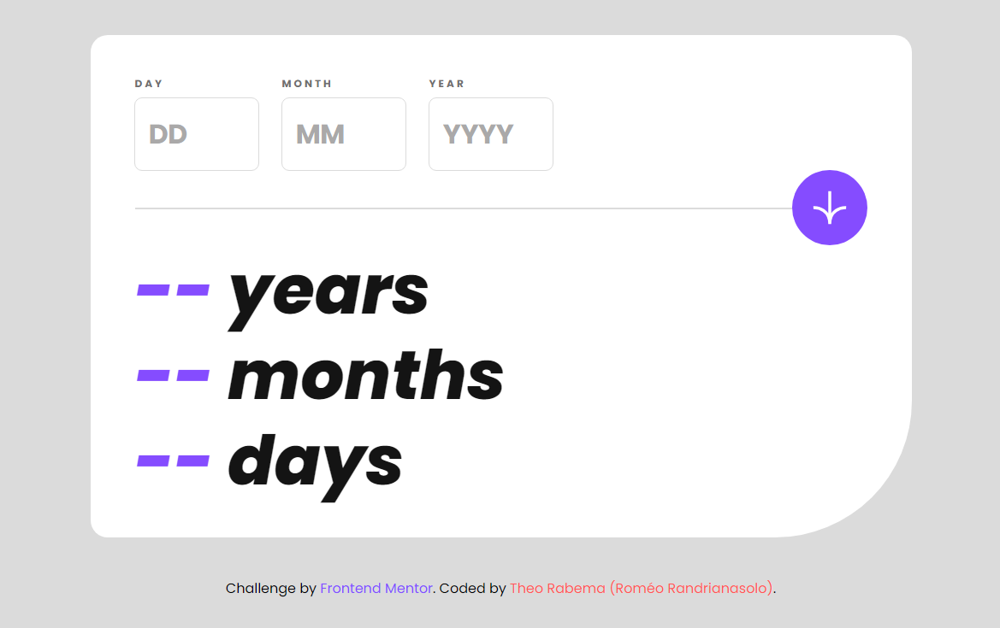
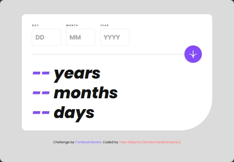
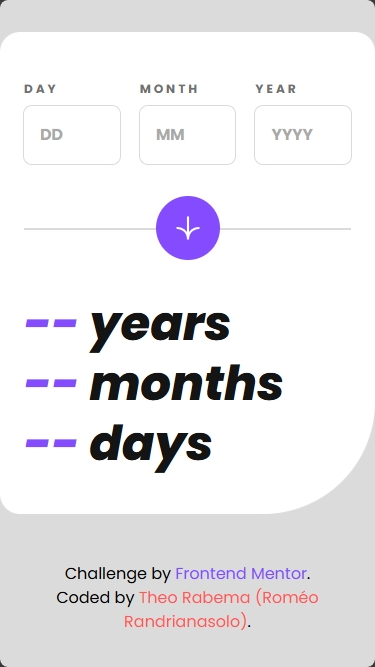

# Frontend Mentor - Age calculator app solution

This is a solution to the [Age calculator app challenge on Frontend Mentor](https://www.frontendmentor.io/challenges/age-calculator-app-dF9DFFpj-Q). Frontend Mentor challenges help you improve your coding skills by building realistic projects. 

## Table of contents

- [Frontend Mentor - Age calculator app solution](#frontend-mentor---age-calculator-app-solution)
  - [Table of contents](#table-of-contents)
  - [Overview](#overview)
    - [The challenge](#the-challenge)
    - [Screenshots](#screenshots)
      - [Desktop view (1024px width and plus)](#desktop-view-1024px-width-and-plus)
      - [Tablet view](#tablet-view)
      - [Mobile view](#mobile-view)
    - [Links](#links)
  - [My process](#my-process)
    - [Built with](#built-with)
    - [What I learned](#what-i-learned)
    - [Continued development](#continued-development)
    - [Useful resources](#useful-resources)
    - [VSCode Extensions](#vscode-extensions)
  - [Author](#author)
  - [Acknowledgments](#acknowledgments)

**Note: Delete this note and update the table of contents based on what sections you keep.**

## Overview

### The challenge

Users should be able to:

- View an age in years, months, and days after submitting a valid date through the form
- Receive validation errors if:
  - Any field is empty when the form is submitted
  - The day number is not between **1-31**
  - The month number is not between **1-12**
  - The year or the resulting date is in the future (not necessarily the year)
  - An input value starts with 0 (**e.g. 06/02/2000**)
  - The date is invalid e.g. **31/04/1991** (there are 30 days in April)
- View the optimal layout for the interface depending on their device's screen size (smartphone, tablet, desktop)
- See hover and focus states for all interactive elements on the page
- **Bonus**: See the age numbers animate to their final number when the form is submitted

### Screenshots
#### Desktop view (1024px width and plus)


#### Tablet view


#### Mobile view


### Links

- Solution URL: [Add solution URL here](https://your-solution-url.com)
- Live Site URL: [Add live site URL here](https://your-live-site-url.com)

## My process
* Set up the environment to use npm as package manager, install the dependencies, add npm `start` *script*, editing the .gitignore and finally creating the local git repo
  ```bash
  npm init
  npm install tailwindcss @tailwindcss/cli -D
  git init
  ```
  ```json
  ...
  "start": "npx @tailwindcss/cli -i ./src/css/input.css -o ./src/css/output.css -w",
  ...
  ```
* Run VSCode Live Server (or any alternative), or open the index.html in the browser
* Start a new git `feat` branch, in order to progressively merge working code to the main branch and implement new ideas inside the *feat* branch

* Start by gathering all the visual properties from the guide and convert them into variables

* Customize tailwind defaults under the `@theme` stack:
  ```css
  /* Doing the reset */
  --breakpoint-*: initial;
  /* Then customize */
  --breakpoint-sm: 375px;
  --breakpoint-md: 768px;
  ...
  /* For the font-size */
  --text-*: initial;
  --text-tiny: 0.75rem;
  ...
  /* For colors */
  --color-*: initial;
  --color-smoke: hsl(0, 1%, 44%);
  ...
  /* For font family */
  --font-*: initial;
  --font-poppins: 'Poppins';
  ...
  ...
  ```

* Set the default whether on the element or under the CSS `base` *layer*
  ```css
  @layer base {
    ...
  }
  ```
  for example with the body font-size and background-color (personal choice).

* Start building the HTML by progressively adding the tailwind classes, with &laquo; *mobile first* &raquo; kept in mind, as well as **parent first**

* Customize *verbose* classlist and single use element (like those with `id`) in the CSS file under the `components` *layer*
  ```css
  @layer components {
    .field { ... }
    .error { ... }
    #result { ... }
  }

* Add custom variants for each input invalid states:
  - `invalid` for any type of incorrectness (*value range*, *incorrect type*)
  - `nonvalid`, similar to *invalid* but is specific to the &laquo; **future date** &raquo; error
  - `required` for mistakenly forget to fill `:required` input; and for any *particularly invalid input type* as of the default validation (behavior) of the input[type=number] element<br/>
    <u>**Examples:**</u>
    *not number value*, *number starting with trailing zero (<code>0</code>)*

### Built with

- Generic elements (except ***section***)
- Tailwindcss version 4
- Tailwind variables, utility classes and custom variants
- Mobile-first workflow
- ESM module system
- Vanilla JS based animations
- Vanilla JS based form validations, more precisely ***exception*** based
  
### What I learned

1. Mobile first workflow
2. Use of @tailwindcss/cli along with `npm start`
3. Customize Tailwind variables, utilities and variants
4. Keeping working codes, implements **new ideas <small>&gt;</small> new codes** instead of replacing (this is why there are many unused functions)
5. Prefer `pure functions` in Javascript
6. Create custom *Error* class extensions

### Continued development
I think that using JS for animations would be more efficient with `asynchroneous programming`, so when it comes to JS based animations or long-running code, I will focus on using the ***async-await*** or ***Promise*** in my code

Anyway, I don't know if I must've used those with the *setInterval/clearInterval* and *setTimeout/clearTimeout* within my code, though it might be interesting


### Useful resources
* [The TailwindCSS Online Docs](tailwindcss.com/docs)
* [Same docs for offline use](github.com/tailwindlabs/tailwindcss.com)
* [Mozilla Developer Network](https://developer.mozilla.org)
* [W3Schools Online Tutorial](https://w3schools.com)
* [Visualized Git Course for Beginner & Professional Developers in 2024](https://www.youtube.com/watch?v=S7XpTAnSDL4&ab_channel=JavaScriptMastery) [Youtube]
* [Intro to Git Fundamentals](https://www.epicweb.dev/tutorials/git-fundamentals/commands/intro-to-git-fundamentals)

### VSCode Extensions
* [Ritwick Dey's Live Server](https://marketplace.visualstudio.com/items?itemName=ritwickdey.LiveServer)
  
  **Installation**
  
  Open VSCode and type ctrl+P, type ext install ritwickdey.liveserver
* [TailwindLabs Tailwind CSS IntelliSense](https://marketplace.visualstudio.com/items?itemName=bradlc.vscode-tailwindcss)
  
  **Installation**
  
  Open VSCode and type ctrl+P, type ext install bradlc.vscode-tailwindcss

## Author

- LinkedIn - [Romeo RANDRIANASOLO](https://linkedin.com/in/romeorandria)
- Frontend Mentor - [@yourusername](https://www.frontendmentor.io/profile/yourusername)
- Twitter - [@yourusername](https://www.twitter.com/yourusername)

## Acknowledgments

* To me!
* To the genius who created Starlink, who made Internet cheaper in Africa
* To the genius at Tailwind, especially for making their docs available for offline use
* To MDN creator, although their offline docs still doesn't work for me
